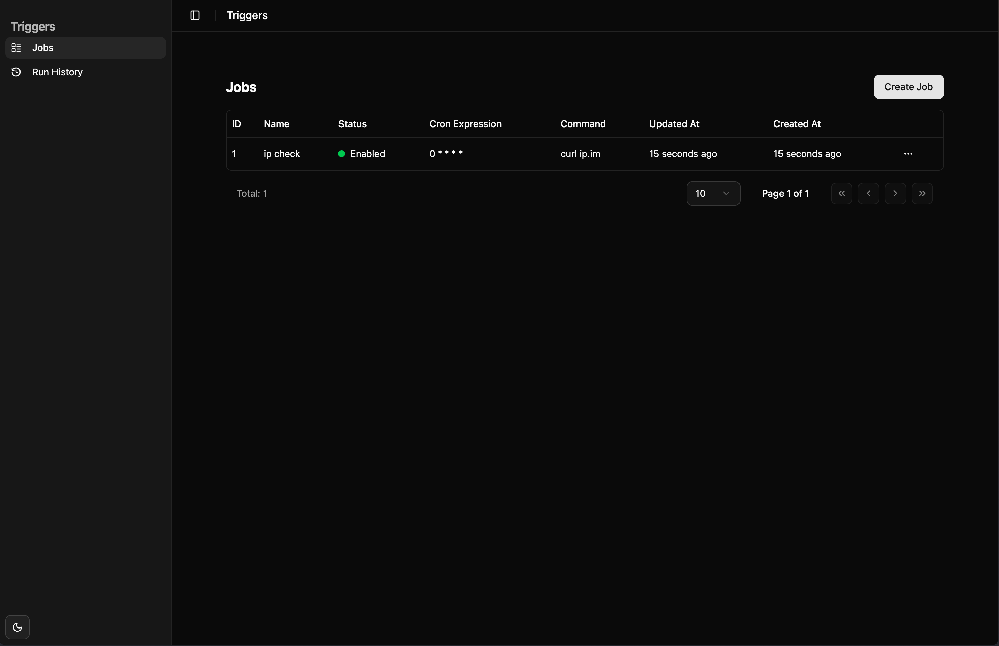

# Easy Trigger

Easy Trigger is a project designed to streamline task scheduling and management. It combines a Go-based backend with a modern React-based frontend, providing a robust and user-friendly interface for managing tasks efficiently.

## Run
```
docker run -p 8080:8080 ixame/easy-trigger:latest
```

## Features

- **Backend**: Built with Go, featuring RESTful APIs for task and log management.
- **Frontend**: Developed using React and TypeScript, styled with Tailwind CSS.
- **Task Scheduling**: Includes a scheduler service for managing tasks.
- **Localization**: Supports multiple languages (e.g., English and Chinese).
- **UI Components**: A rich set of reusable UI components for building dynamic interfaces.



## Project Structure

### Backend
- **Main File**: `main.go`
- **Controllers**: Located in `controllers/` (e.g., `log_controller.go`, `task_controller.go`).
- **Models**: Located in `models/` (e.g., `db.go`, `log.go`, `task.go`).
- **Services**: Located in `services/` (e.g., `scheduler_service.go`, `task_service.go`).
- **Utilities**: Located in `utils/` (e.g., `response.go`).

### Frontend
- **Entry Point**: `frontend/src/main.tsx`
- **Pages**: Located in `frontend/src/pages/` (e.g., `main/jobs`, `main/history`).
- **Components**: Located in `frontend/src/components/` (e.g., `ui`, `layout`).
- **Hooks**: Located in `frontend/src/hooks/` (e.g., `use-pagination.tsx`, `use-local-storage.tsx`).
- **Localization**: Located in `frontend/src/locale/` (e.g., `en-US`, `zh-CN`).

## Prerequisites

- **Backend**: Go 1.20+ installed.
- **Frontend**: Node.js 16+ and pnpm installed.
- **Database**: SQLite (default).

## Getting Started

### Backend
1. Install dependencies:
   ```bash
   go mod tidy
   ```
2. Run the backend server:
   ```bash
   go run main.go
   ```

### Frontend
1. Navigate to the `frontend` directory:
   ```bash
   cd frontend
   ```
2. Install dependencies:
   ```bash
   pnpm install
   ```
3. Start the development server:
   ```bash
   pnpm dev
   ```

## Deployment

### Docker
1. Build and run the Docker containers:
   ```bash
   docker-compose up --build
   ```

## Contributing

Contributions are welcome! Please fork the repository and submit a pull request.

## License

This project is licensed under the MIT License. See the [LICENSE](LICENSE) file for details.

## Acknowledgments

- Built with Go, React, and Tailwind CSS.
